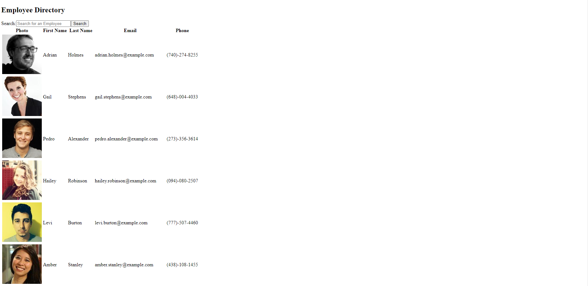
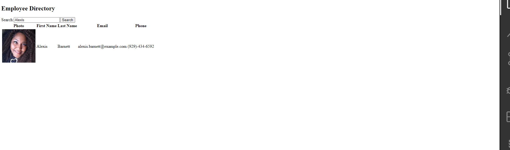
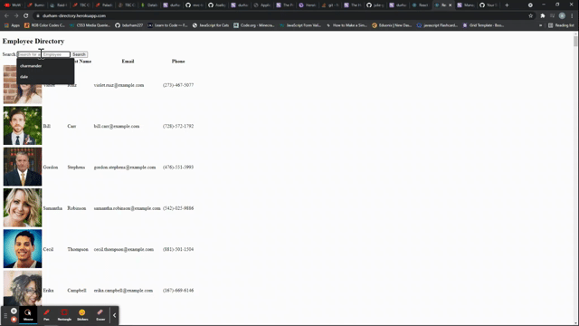

# React-User-Directory

 ## Table of Contents
1. [Description](#description)

2. [Installation](#installation)

3. [Usage](#usage)

4. [Questions](#questions)

-----

## Description
The React-User-Directory is a client-side application that enables users to quickly and dynamically serach for an employee by first name, last name, email or phone number. The employee list used on this application makes an API GET request to https://randomuser.me to populate with data

 -----

 ## Installation
 

   Getting Started:
   * check NodeJs is installed
   * Clone my Repository- git clone https://github.com/bdurham227/React-User-Directory
   * npm install
   * npm init
   * run "npm start" on your command line
  
    node -v
    npm install
    npm init --yes
  

  

 ## Technology Used

* NodeJs
* HTML5
* CSS 3
* Javascript
* React

Visit the Deployed site: 
https://durham-directory.herokuapp.com/

Screenshot of Application:
--

Screenshot of Search Result: 

Visit the Repo: 
[Github]**<https://github.com/bdurham227/Tech-Blog>**

   

 ## License
 

   https://opensource.org/licenses/MIT

    Licensed under the MIT License

    Copyright © [2021] [Benjamin Durham]
    

         Permission is hereby granted, free of charge, to any person obtaining a copy of this software and associated documentation files (the "Software"), to deal in the Software without restriction, including without limitation the rights to use, copy, modify, merge, publish, distribute, sublicense, and/or sell copies of the Software, and to permit persons to whom the Software is furnished to do so, subject to the following conditions:
        
        The above copyright notice and this permission notice shall be included in all copies or substantial portions of the Software.
        
        THE SOFTWARE IS PROVIDED "AS IS", WITHOUT WARRANTY OF ANY KIND, EXPRESS OR IMPLIED, INCLUDING BUT NOT LIMITED TO THE WARRANTIES OF MERCHANTABILITY, FITNESS FOR A PARTICULAR PURPOSE AND NONINFRINGEMENT. IN NO EVENT SHALL THE AUTHORS OR COPYRIGHT HOLDERS BE LIABLE FOR ANY CLAIM, DAMAGES OR OTHER LIABILITY, WHETHER IN AN ACTION OF CONTRACT, TORT OR OTHERWISE, ARISING FROM, OUT OF OR IN CONNECTION WITH THE SOFTWARE OR THE USE OR OTHER DEALINGS IN THE SOFTWARE

 ## Questions
 ---
 For additional questions about usage, installation or application improvement contact me through

Github: https://github.com/bdurham227
Repository: https://github.com/bdurham227/React-User-Directory

Email: bdurham227@gmail.com:

